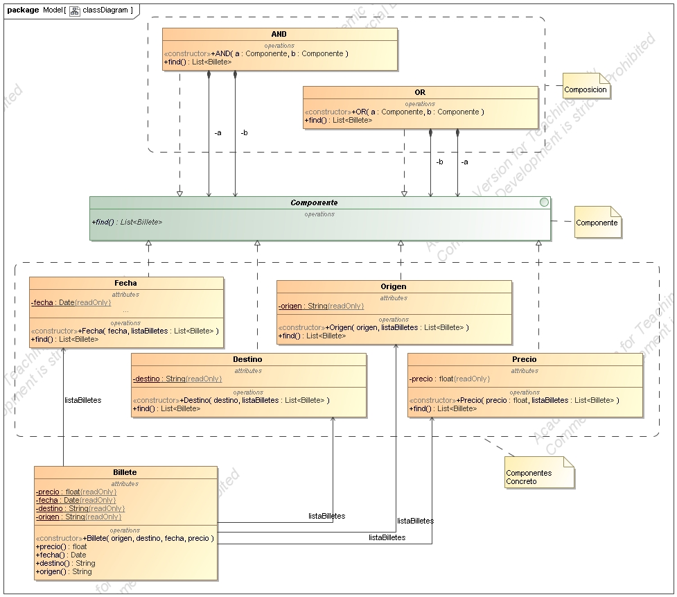
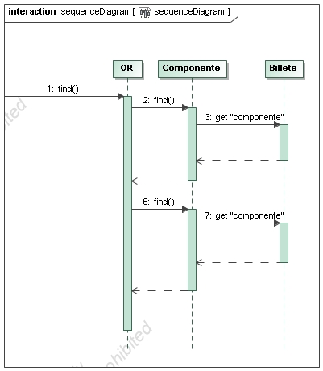

# Principios de Diseño  
## **SRP** Principio de Responsabilidad Unica  
Nuestros objetos y/o clases solo realizan un trabajo, es decir, no delegamos todo en una clase Dios, para así facilitar
la futura modificación o adición de nuevos filtros en nuestra búsqueda de billetes.
## **DIP** Principio de Inversión de la dependencia
El principio de inversión de la dependencia consiste en depender de clases abstractas y/o interfaces en vez de clases
concretas.  
En nuestro caso, los **Componentes Concretos** implementan nuestra interfaz **Componente**, añadiendo una capa
de abstracción que nos permitirá añadir futuros componentes facilmente.
# Patrones de Diseño
## Patrón Composición
El patrón Composición se usa para componer objetos (Billetes en nuestro caso) con una estructura arbórea que representa
una jerarquía todo-parte.  
Permite tratar uniformemente a los componentes concretos y a las composiciones de estos objetos.  
En este caso nos decantamos por su uso ya que tratamos a los campos del billete como **Componentes Concretos**, y a la combinación
mediante AND y OR de los filtros como **Composición**, ya que permite añadir nuevos requisitos y mezclarlos según convenga de 
manera muy intuitiva y sencilla.
## Patrón Inmutable
Usamos el patrón Inmutable para hacer que nuestros Billetes solo puedan ser modificados antes de su creación, es decir una
vez creados ya no se puede cambiar ninguno de sus valores (declarando sus atributos final, private.., declarando la clase como final..)
También nuestros **Componentes Concretos** son inmutables.  

## Diagrama Dinámico
El diagrama de secuencia muestra como funciona nuestro método *find* en la clase *OR* (sería exactamente igual en *AND*), llamando al método
*find* en cada uno de los *Componentes Concretos*  

