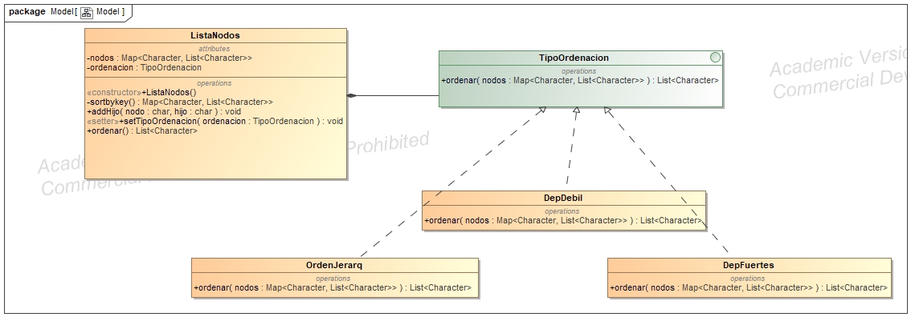
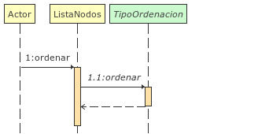

# Principios de diseño 
## **SRP** Principio de responsabilidad única
Siguiendo este principio cada objeto debe tener una responsabilidad única lo que facilitará modificarlos más tarde, ya que solo tendrán un posible motivo para ello.
En nuestro código seguimos esto en las clases *DepFuerte*, *DepDebil* y *OrdenJararq*, que tienen el único objetivo de devolver una lista ordenada dado un Map.
## **DIP** Principio de inversión de dependencia 
El principio de inversión de dependencia consiste en usar interfaces o clases y funciones abstractas, en vez de depender de clases y funciones concretas.  
Seguimos este principio al crear un interfaz *TipoOrdenacion* y luego implementando los algoritmos bajo este, añadiendo una capa de abstración que nos permitirá añadir y o modificar los algoritmos sin tener que cambiar más código.
También se puede ver a la hora de asignar el Map *nodos* en la clase *ListaNodos*, lo asignamos como Map y luego lo inicializamos con la implementación concreta de Map "HashMap"
Esto mismo ocurre a la hora de crear listas en las clases de tipo *TipoOrdenacion*, las asignamos como List y luego le damos la implementación concreta Arraylist.

# Patrón de diseño
## Patrón estrategia 
El patrón estrategia nos permite encapsular los algoritmos de ordenación con una interfaz única, haciendolos intercabiables y al mismo tiempo facilitando añadir otros algoritmos más tarde.  
El **contexto** en nuestro caso será la clase *ListaNodos*, que delega la ordenación de la lista a la **estrategia** en este caso la interfaz *TipoOrdenación* y luego tendremos nuestras **estrategias concretas** para ordenar dicha lista, que son las clases *DepDebil*, *DepFuerte* y *OrdenJerarq*.  

### Diagrama dinámico
El diagrama de secuencia muestra como funciona el método *ordenar* en *ListaNodos* llamando al método del mismo nombre en un objeto de tipo *TipoOrdenacion* que devolverá la lista ordenada.  

