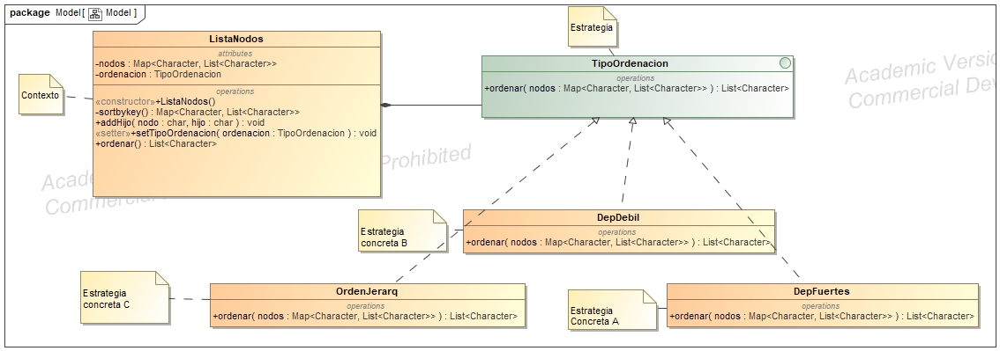

# Principios de diseño 
## **SRP** Principio de responsabilidad única
DepFuerte, DepDebil y OrdenJerarq tienen la única responsabilidad de debolver
una lista con el orden
## **DIP** Principio de inversión de dependencia 
list map en lugar de ArrayList HashMap
## **ISP** Principio de segregación de interfaces
interfaz para ordenación
# Patrón de diseño
## Patrón estrategia 
El patrón estrategia nos permite encapsular los algoritmos de ordenación con una interfaz
única, haciendolos intercabiables y al mismo tiempo facilitando añadir otros algoritmos 
más tarde.  
El **contexto** en nuestro caso será la clase *ListaNodos*, que delega la ordenación de la
lista a la **estrategia** en este caso la interfaz *TipoOrdenación* y luego tendremos 
nuestras **estrategias concretas** para ordenar dicha lista, que son las clases *DepDebil*
, *DepFuerte* y *OrdenJerarq*.

